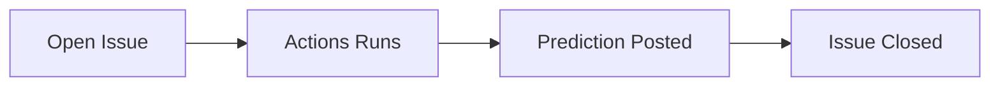
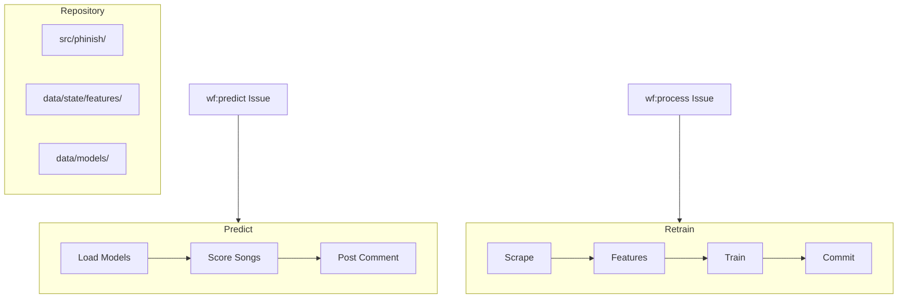

# 🎸 Phinish

**ML-powered Phish setlist predictions that run themselves from a GitHub repo.**

Issues are the API. Actions are the compute. The repo is the database.

[**→ Request a Prediction**](../../issues/new?assignees=&labels=wf%3Apredict&template=predict-show.yml) · [**Browse Predictions**](../../issues?q=label%3Awf%3Adone%3Apredict) · [**Dashboard**](https://nate-rogan.github.io/phinish)

---

## How It Works



The entire system — data ingestion, feature engineering, model training, inference, and serving — runs from this repository. No servers. No containers. No cloud accounts.

---

## Using Phinish

Every workflow can be triggered via a GitHub issue or run locally with pixi. The Actions workflows are thin wrappers around the same pixi tasks.

### Predict a Show

| | GitHub | Local |
|---|--------|-------|
| **How** | Open a [Predict issue](../../issues/new?assignees=&labels=wf%3Apredict&template=predict-show.yml) | `pixi run predict --date 2026-12-31 --venue "MSG"` |
| **With LLM summary** | Select a voice in the issue form | `pixi run summarize --date 2026-12-31 --venue "MSG" --voice "Full Phan"` |
| **What happens** | Loads committed models, scores candidates, posts setlist as a comment | Same pipeline, prints to stdout |
| **Requires** | — | `ANTHROPIC_API_KEY` in `.env` (for summarize only) |

### Retrain the Model

| | GitHub | Local |
|---|--------|-------|
| **How** | Open a [Process Year issue](../../issues/new?assignees=&labels=wf%3Aprocess&template=process-year.yml) | `pixi run scrape --year 2025 && pixi run retrain` |
| **What happens** | Scrapes year from Phish.net → rebuilds features → retrains all models → commits artifacts | Same pipeline, no commit |
| **Full bootstrap** | Not available (use local) | `pixi run bootstrap` (scrapes 1983–present, ~5 min) |
| **Partial bootstrap** | Not available (use local) | `for y in $(seq 1983 2000); do pixi run scrape -- --year $y; done && pixi run retrain` |
| **Requires** | `PHISHNET_API_KEY` secret | `PHISHNET_API_KEY` in `.env` |

### Quality Checks

```bash
pixi run -e dev lint          # ruff check
pixi run -e dev fmt           # ruff format
pixi run -e dev test          # pytest
pixi run -e dev check         # lint + test
```

---

## Model Performance

Evaluated on held-out shows using temporal train/test split (no future data leakage):

| Model | Precision@25 | Opener Correct | Pair Matches |
|---|---|---|---|
| Frequency Baseline | 42% | 8% | 2% |
| Gap-Weighted Baseline | 58% | 15% | 4% |
| XGBoost (solo) | 61% | 22% | 8% |
| Markov Chain (solo) | — | 18% | 15% |
| **Ensemble** | **64%** | **28%** | **18%** |

The strongest single predictor is the **rotation gap** — Phish almost never repeats a song within 2–3 shows. The XGBoost model learns interactions between gap, venue history, tour position, and 25+ other features. The Markov chain captures sequential flow (Mike's Song → Hydrogen, 65% of the time).

---

## Tech Stack

| Layer | Technology | Role |
|-------|-----------|------|
| **ML Models** | XGBoost, order-2 Markov chains, frequency/gap baselines | Song selection, sequential flow, rotation priors |
| **Ensemble** | Grid-searched blending weights, Platt calibration | Combines 4 models; weights tuned on validation year |
| **Feature Engineering** | StreamingState, temporal split (train ≤ 2023, val 2024, test 2025+) | Prevents future data leakage; streaming accumulator |
| **LLM Integration** | Claude Haiku via httpx + stamina (no SDK) | Fan-voiced prediction summaries with selectable voice |
| **Data Ingestion** | Phish.net API v5, stamina retry (429/5xx), httpx | ~2,100 shows, ~300 candidate songs |
| **Venue Resolution** | difflib SequenceMatcher, alias table | Fuzzy-matches user input to 1,600+ known venues |
| **Serialization** | msgspec Structs | Typed, fast JSON serialization throughout |
| **Environment** | pixi (conda + pip), hatchling, editable install | Reproducible env; single `pixi run bootstrap` setup |
| **CI/CD** | GitHub Actions (issue-triggered), GitHub Pages | Serverless compute; repo-as-infrastructure |
| **Code Quality** | ruff (lint + format + NumPy docstrings), pytest, structlog | Enforced style; structured logging; typed library/CLI split |

---

## Architecture



Raw setlist data is never committed (per Phish.net API terms). Trained models, feature aggregates, and a `StreamingState` snapshot are committed as derivative artifacts. Predictions load the snapshot directly and require no scraping.

---

## Project Structure

```
phinish/
├── .github/
│   ├── ISSUE_TEMPLATE/         # predict-show.yml, process-year.yml
│   └── workflows/
│       ├── ci.yml              # Lint + test on push
│       ├── predict.yml         # Issue-triggered inference
│       └── process.yml         # Issue-triggered retrain
├── src/phinish/
│   ├── utils/                  # Helpers (json, paths, sanitize, venue resolution)
│   ├── scrape/                 # Phish.net ingestion
│   ├── features/               # Gaps, stats, transitions, venue history
│   ├── train/                  # Baseline, markov, xgboost, ensemble trainers
│   ├── predict/                # Inference pipeline + CLI
│   ├── evaluate/               # Temporal-holdout backtesting
│   ├── summarize/              # LLM prediction summaries (Claude Haiku)
│   └── process/                # GitHub Actions entry points
├── data/
│   ├── canonical_names.json    # Song-name normalization mapping
│   ├── source/                 # Raw setlists (gitignored)
│   ├── state/features/         # Aggregate features (committed)
│   └── models/                 # Trained artifacts + state snapshot (committed)
├── tests/                      # pytest suite
├── pyproject.toml              # pixi config, ruff config, entry points
└── CLAUDE.md                   # AI-assisted development conventions
```

---

## Design Decisions

**Why not a neural network?**
Setlist prediction is a structured sequence problem with ~2,100 training examples and ~300 candidate items. Classical ML dominates on tabular data at this scale. A transformer would overfit. Gradient boosted trees train in under a minute and give interpretable feature importance.

**Why not a server/API?**
Predictions are requested a few times a day. GitHub Actions provides free on-demand compute. The repo-as-infrastructure pattern eliminates all ops burden.

**Why ensemble over a single model?**
Each model captures a different signal: XGBoost learns multi-feature interactions, Markov chains capture sequential flow, the gap heuristic provides a rotation prior. Combining them with learned weights should capture more signal than any individual model alone.

**Why recompute gaps instead of using the API's values?**
The API gives the *current* gap. Training requires the gap *at the time of each historical show*. We recompute from the raw setlist sequence to avoid future data leakage.

**Why Claude Haiku and not a bigger model?**
The summary is 3–4 sentences of styled prose, not complex reasoning. Haiku responds in under a second and handles persona-driven writing well. We call the Messages API directly via httpx + stamina — a single API call doesn't justify the SDK's ~15 transitive dependencies.

---

## Documentation

- **[SPEC.md](docs/specs/SPEC.md)** — system specification
- **[PLAN.md](docs/plans/PLAN.md)** — phased build plan
- **[Model Card](data/models/model_card.md)** — model version, training data, metrics

---

## Attribution

Setlist data provided by [Phish.net](https://phish.net), a project of the non-profit Mockingbird Foundation. This project is not affiliated with Phish or Phish.net.
