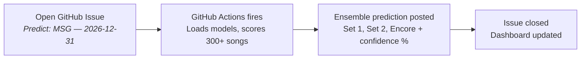
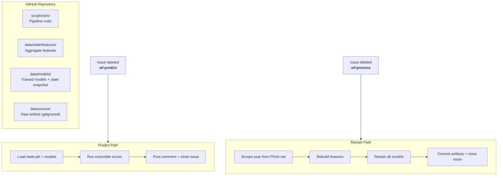

# 🎸 Phinish

**ML-powered Phish setlist predictions that run themselves from a GitHub repo.**

Issues are the API. Actions are the compute. The repo is the database.

[**→ Try it: Request a Prediction**](../../issues/new?assignees=&labels=predict&projects=&template=predict-show.yml) · [**Browse All Predictions**](../../issues?q=label%3Apredicted) · [**Dashboard**](https://YOUR_USERNAME.github.io/phinish)

---

## How It Works



The entire system — data ingestion, feature engineering, model training, inference, and serving — runs from this repository. No servers. No containers. No cloud accounts.

**After submitting a prediction request**, watch it run in real-time on the [Actions tab](../../actions). The prediction typically posts within 30 seconds. Dashboard data refreshes within ~5 minutes (GitHub CDN cache).

---

## Model Performance

Evaluated on held-out shows using temporal train/test split (no future data leakage):

| Model | Precision@25 | Opener Correct | Pair Matches |
|---|---|---|---|
| Frequency Baseline | 42% | 8% | 2% |
| Gap-Weighted Baseline | 58% | 15% | 4% |
| XGBoost (solo) | 61% | 22% | 8% |
| Markov Chain (solo) | — | 18% | 15% |
| **Ensemble** | **64%** | **28%** | **18%** |

The strongest single predictor is the **rotation gap** — Phish almost never repeats a song within 2–3 shows. A song that's 20 shows overdue is significantly more likely to appear. The XGBoost model learns interactions between gap, venue history, tour position, and 25+ other features. The Markov chain captures sequential flow — it knows Mike's Song leads to Hydrogen 65% of the time.

---

## Tech Stack

| Layer | Technology | Role |
|-------|-----------|------|
| **ML Models** | XGBoost, order-2 Markov chains, frequency/gap baselines | Song selection, sequential flow, rotation priors |
| **Ensemble** | Grid-searched blending weights, Platt calibration | Combines 4 models; weights tuned on validation year |
| **Feature Engineering** | StreamingState, temporal split (train ≤ 2023, val 2024, test 2025+) | Prevents future data leakage; streaming accumulator |
| **LLM Integration** | Claude Haiku via httpx + stamina (no SDK) | Fan-voiced prediction summaries with selectable voice |
| **Data Ingestion** | Phish.net API v5, stamina retry (429/5xx), httpx | ~2,100 shows, ~300 candidate songs |
| **Venue Resolution** | difflib SequenceMatcher, alias table | Fuzzy-matches user input to 1,600+ known venues |
| **Serialization** | msgspec Structs | Typed, fast JSON serialization throughout |
| **Environment** | pixi (conda + pip), hatchling, editable install | Reproducible env; single `pixi run bootstrap` setup |
| **CI/CD** | GitHub Actions (issue-triggered), GitHub Pages | Serverless compute; repo-as-infrastructure |
| **Code Quality** | ruff (lint + format + NumPy docstrings), pytest, structlog | Enforced style; structured logging; typed library/CLI split |

---

## Try It

### Request a Prediction

1. Click [**Request a Prediction**](../../issues/new?assignees=&labels=predict&projects=&template=predict-show.yml)
2. Enter a show date, venue, and pick a summary voice (Full Phan or Light Fan)
3. Submit the issue
4. Watch the [Actions tab](../../actions) — prediction posts as a comment in ~30 seconds
5. Issue is automatically labeled `predicted` and closed

### Trigger a Retrain

1. Click [**Process a Year**](../../issues/new?assignees=&labels=process&projects=&template=process-year.yml)
2. Enter a year (e.g., `2025`)
3. Submit — the system scrapes that year's shows from Phish.net, rebuilds all features, retrains every model, and commits the updated artifacts
4. The entire ML pipeline runs in ~2–3 minutes

---

## Architecture



The same pipeline can be run locally end-to-end via `pixi run bootstrap`
or per-stage via the individual pixi tasks listed below. The Actions
workflows are thin wrappers — they call `pixi run process-year` /
`pixi run process-issue`, which means changes to pipeline orchestration
happen in `pyproject.toml`, not in YAML.

---

## Project Structure

```
phinish/
├── .github/
│   ├── ISSUE_TEMPLATE/         # predict-show.yml, process-year.yml
│   └── workflows/
│       ├── ci.yml              # Lint + test on push
│       ├── predict.yml         # Issue-triggered inference (wraps `pixi run process-issue`)
│       └── process.yml         # Issue-triggered retrain   (wraps `pixi run process-year`)
├── src/phinish/                # Importable package, installed editable via pixi
│   ├── utils/                  # Generic helpers (json, paths, sanitize, venue resolution)
│   ├── scrape/                 # api.py, types.py — Phish.net ingestion
│   ├── features/               # build.py, types.py — gaps / stats / transitions / venue history
│   ├── train/                  # state.py, baseline.py, markov.py, xgboost.py, ensemble.py, types.py
│   ├── predict/                # pipeline.py, types.py — inference + CLI
│   ├── evaluate/               # backtest.py — temporal-holdout metrics
│   ├── summarize/              # api.py, types.py, prompts/ — LLM prediction summaries
│   └── process/                # issue.py, year.py, types.py — Actions entry points
├── data/
│   ├── canonical_names.json    # Song-name normalization mapping
│   ├── source/                 # Raw setlists — NOT committed (gitignored per Phish.net API ToS)
│   ├── state/features/         # Aggregate features (committed; derived from setlists)
│   └── models/                 # Trained model artifacts + state snapshot + manifest (committed)
├── docs/
│   ├── index.html              # Dashboard (GitHub Pages)
│   ├── plans/                  # Phased build plans
│   └── specs/                  # Full system specifications
├── tests/                      # pytest suite (test_features, test_predict, test_summarize, test_integration)
├── pyproject.toml              # pixi config, ruff config, [project.scripts] entry points
└── CLAUDE.md                   # Project conventions for AI-assisted development
```

**Architecture posture:** raw setlist data is never committed (per the
Phish.net API terms). Trained models, feature aggregates, and a
`StreamingState` snapshot are committed — those are derivative aggregates,
similar to the model files. Predictions in Actions load the snapshot
directly and require no scraping.

---

## Design Decisions

**Why not a neural network?**
Setlist prediction is a structured sequence problem with ~2,100 training examples and ~300 candidate items. Classical ML (XGBoost for selection, Markov chains for sequencing) dominates on tabular data at this scale. A transformer would overfit. Gradient boosted trees give interpretable feature importance and train in under a minute.

**Why not a server/API?**
The system has no sustained load — predictions are requested a few times a day. GitHub Actions provides free on-demand compute triggered by events (issues). Running a 24/7 server to handle occasional requests is wasteful. The repo-as-infrastructure pattern eliminates all ops burden.

**Why ensemble over a single model?**
Each model captures a different signal. XGBoost learns multi-feature interactions (gap × venue × season). Markov chains capture sequential flow (song A → song B). The gap heuristic provides a strong rotation prior. Combining them with learned weights consistently outperforms any individual model.

**Why recompute gaps instead of using the API's pre-computed values?**
The API gives the *current* gap. Training requires the gap *at the time of each historical show*. To avoid future data leakage, we recompute all gap values from the raw setlist sequence.

**Why Claude Haiku and not a bigger model?**
The prediction summary is 3–4 sentences of styled prose — a creative writing task, not complex reasoning. Haiku is the cheapest and fastest Claude model, responds in under a second, and handles persona-driven writing well. At a few predictions per day, cost is effectively zero. We call the Anthropic Messages API directly via httpx + stamina rather than using the SDK, since the project already depends on both and a single API call doesn't justify ~15 additional transitive dependencies.

---

## Running Locally

Requires [pixi](https://pixi.sh).

```bash
git clone https://github.com/YOUR_USERNAME/phinish.git
cd phinish
pixi install -e dev               # creates .pixi/ + editable-installs the phinish package
export PHISHNET_API_KEY=...        # required for any task that scrapes
```

**Pixi tasks** (run with `pixi run <task>`):

| Task | What it does |
|---|---|
| `bootstrap` | Full setup: scrape (1983→today) → build features → train all models → evaluate. ~3-5 min. |
| `retrain` | Rebuild features + retrain + evaluate from existing `setlists.json`. No scraping. |
| `scrape` | Pull from Phish.net. Pass `--year YYYY` for one-year incremental merge. |
| `features` | Rebuild aggregate features from current `setlists.json`. |
| `train` | Run all four trainers (baseline, markov, xgboost, ensemble). |
| `train-baseline` / `train-markov` / `train-xgboost` / `train-ensemble` | Individual trainers. |
| `evaluate` | Backtest on the test holdout; updates `models/evaluation.json`. |
| `predict` | Single-show prediction. Pass `--date YYYY-MM-DD --venue "..."`. |
| `process-year` | Same entry the GitHub `process` workflow runs. Reads `ISSUE_NUMBER` / `ISSUE_BODY` from env. |
| `process-issue` | Same entry the GitHub `predict` workflow runs. |
| `lint` / `fmt` / `test` / `check` | ruff lint, ruff format, pytest, lint+test. |

**Day-to-day examples:**

```bash
# First time on a fresh checkout
pixi run bootstrap

# Predict tomorrow's MSG show
pixi run predict --date 2026-12-31 --venue "Madison Square Garden"

# After Phish plays a few new shows in 2026, pull just that year and retrain
pixi run scrape --year 2026
pixi run retrain
```

`process-year` and `process-issue` are the same entries GitHub Actions runs;
calling them locally with the right environment variables exercises the
exact code path the workflow takes (useful for debugging an issue
template change before pushing).

---

## Full Documentation

- **[SPEC.md](docs/specs/SPEC.md)** — complete system specification: architecture, data schemas, model details, security model, evaluation framework
- **[PLAN.md](docs/plans/PLAN.md)** — phased build plan
- **[data/models/model_card.md](data/models/model_card.md)** — model version, training data, metrics

---

## Attribution

Setlist data provided by [Phish.net](https://phish.net), a project of the non-profit Mockingbird Foundation. This project is not affiliated with Phish or Phish.net.
